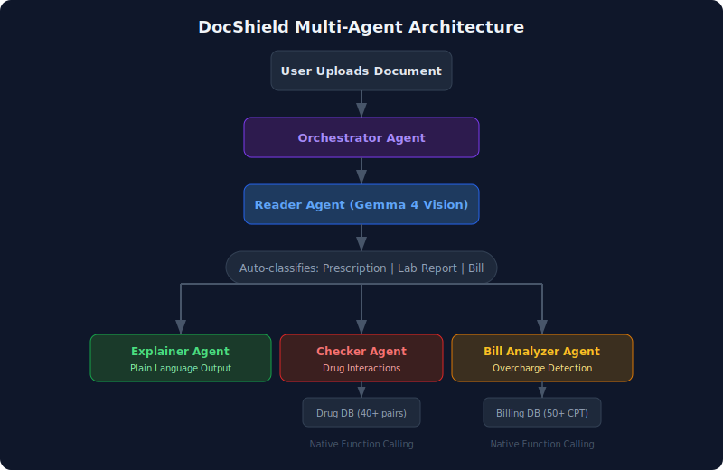
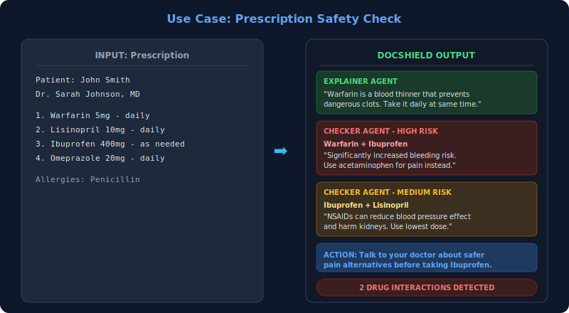
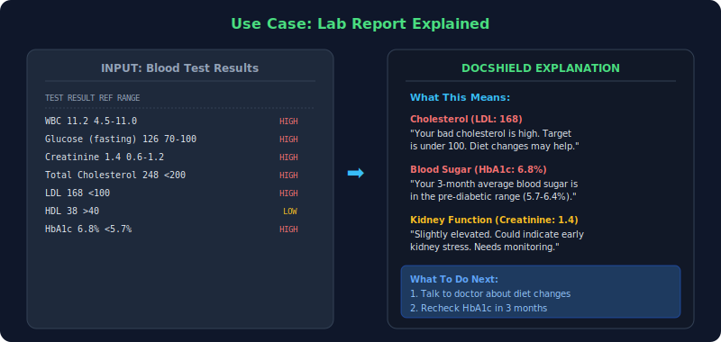
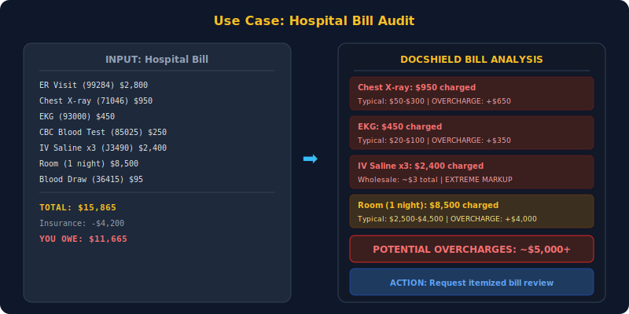

<div align="center">

# DocShield

### Privacy-First Medical Document Assistant

*Your medical documents, explained simply. Zero data leaves your device.*

[](https://ai.google.dev/gemma)
[](#privacy)
[](#testing)
[](LICENSE)

Built for the [**Kaggle Gemma 4 Good Hackathon**](https://www.kaggle.com/competitions/gemma-4-good-hackathon) | $200K Prize Pool

</div>

---

## The Problem

Billions of people receive medical documents they can't understand. They upload sensitive health data to cloud AI tools, risking their most private information. Meanwhile:

| Problem | Scale |
|---------|-------|
| **Drug interactions** cause preventable deaths | 125,000+ deaths/year in the US |
| **Billing errors** in hospital bills | ~80% of bills contain errors |
| **Health literacy** is critically low | 36% of US adults have basic or below |

## The Solution

DocShield is a **multi-agent AI system** powered by **Gemma 4** that reads, explains, and checks your medical documents — **entirely on your device**.

Upload any medical document and DocShield will:
1. **Read it** — Extract text from photos, scans, handwritten notes
2. **Explain it** — Translate medical jargon into plain language
3. **Check drug safety** — Flag dangerous drug interactions
4. **Catch billing errors** — Identify overcharges in hospital bills

---

## Architecture

<div align="center">



</div>

### Agents

| Agent | Role | Gemma 4 Feature |
|-------|------|----------------|
| **Orchestrator** | Auto-classifies document type, routes to specialists | Text Classification |
| **Reader** | Extracts text from photos, scans, handwriting | **Multimodal Vision** |
| **Explainer** | Translates jargon to plain language anyone can understand | Long Context, Reasoning |
| **Checker** | Finds dangerous drug interactions in prescriptions | **Native Function Calling** |
| **Bill Analyzer** | Flags overcharges and billing errors | **Native Function Calling** |

---

## Use Cases

### 1. Prescription Safety Check

<div align="center">



</div>

> A patient receives a prescription with **Warfarin + Ibuprofen**. DocShield's Checker Agent uses Gemma 4's native function calling to query the drug interaction database and flags a **HIGH RISK** bleeding danger — potentially saving a life.

---

### 2. Lab Report Explained

<div align="center">



</div>

> A patient gets blood test results with values like "LDL: 168" and "HbA1c: 6.8%". DocShield's Explainer Agent translates this into plain language: *"Your bad cholesterol is high. Your blood sugar is in the pre-diabetic range."*

---

### 3. Hospital Bill Audit

<div align="center">



</div>

> A patient receives a $16,000 hospital bill. DocShield's Bill Analyzer uses function calling to look up typical costs and flags **$5,000+ in potential overcharges** — including a $950 chest X-ray that typically costs $50-$300.

---

## Quick Start

```bash
# 1. Install Ollama and pull Gemma 4
# Download Ollama: https://ollama.com/download
ollama pull gemma4

# 2. Clone and install
git clone https://github.com/kennedyraju55/docshield.git
cd docshield
pip install flask pillow requests

# 3. Run
python app.py

# 4. Open http://localhost:5000
```

### Try It Instantly
The web UI includes **sample buttons** — click "Prescription", "Lab Report", or "Hospital Bill" to load a sample document and see DocShield in action without uploading anything.

---

## Privacy

| Feature | Detail |
|---------|--------|
| **Zero cloud calls** | Everything runs on your machine via Ollama |
| **No data collection** | Your documents never leave your device |
| **No internet required** | Works fully offline after initial setup |
| **On-device ready** | Designed for Gemma 4 E4B (runs on phones) |
| **No logging** | Server doesn't store or log any document data |

Your medical documents are the most sensitive data you have. DocShield ensures they stay on your device.

---

## Testing

```bash
pip install pytest
pytest tests/ -v    # 22 tests, all passing
```

Tests cover:
- Drug interaction lookups (exact match, brand names, aliases, edge cases)
- Billing cost lookups (CPT codes, keywords, unknown codes)
- Agent logic with mock backend (reader, explainer, routing)
- Flask endpoints (health check, upload, analyze)

---

## Tech Stack

| Component | Technology |
|-----------|-----------|
| AI Model | Gemma 4 via Ollama (local) / Google GenAI (Kaggle) |
| Backend | Python 3.12, Flask |
| Frontend | Single-page HTML/JS, SSE streaming |
| Drug Database | 40+ interactions, 50+ brand name aliases |
| Billing Database | 50+ CPT codes with typical US price ranges |
| Medical Abbreviations | 70+ common abbreviations |

## Project Structure

```
docshield/
  agents/
    orchestrator.py        - Document classifier + agent router
    reader_agent.py        - Image/text extraction via Gemma 4 vision
    explainer_agent.py     - Medical jargon to plain language
    checker_agent.py       - Drug interaction checker (function calling)
    bill_analyzer_agent.py - Billing error detector (function calling)
  tools/
    drug_interactions.py   - Drug interaction database + lookup
    billing_reference.py   - CPT code + billing database + lookup
    tool_registry.py       - Function calling registry for Gemma 4
  ollama_backend.py        - Local Ollama integration
  kaggle_backend.py        - Kaggle/Google GenAI integration
data/
  drug_interactions.json   - 40+ drug-drug interactions with severity
  billing_codes.json       - 50+ CPT codes with typical price ranges
  medical_abbreviations.json - 70+ common medical abbreviations
templates/
  index.html               - Web UI with drag-and-drop + camera capture
tests/                     - 22 tests (tools, agents, endpoints)
notebook.ipynb             - Kaggle submission notebook
```

---

## Hackathon

| | |
|-|-|
| **Competition** | [Gemma 4 Good Hackathon](https://www.kaggle.com/competitions/gemma-4-good-hackathon) |
| **Track** | Health |
| **Prize Pool** | $200,000 |
| **Deadline** | May 18, 2026 |

### Gemma 4 Features Showcased

| Feature | How DocShield Uses It |
|---------|----------------------|
| **Multimodal Vision** | Reads photos of documents, handwritten prescriptions, scanned reports |
| **Native Function Calling** | Queries drug interaction DB and billing cost DB via structured tool calls |
| **Multi-Agent Architecture** | 5 specialized agents orchestrated in a pipeline |
| **On-Device (E4B)** | Full privacy, works offline on consumer hardware |
| **Long Context (256K)** | Handles multi-page medical records in a single pass |

### Impact

| Problem | DocShield's Role |
|---------|-----------------|
| Health illiteracy affects billions | Plain language explanations for any document |
| 125K+ drug interaction deaths/year | Automated interaction checking with 40+ known pairs |
| 80% of hospital bills have errors | Cost comparison against national averages |
| Millions upload health data to cloud | 100% local, zero-data-leakage processing |

---

## License

MIT

---

<div align="center">

*Built with Gemma 4 for a healthier, more informed world.*

</div>
