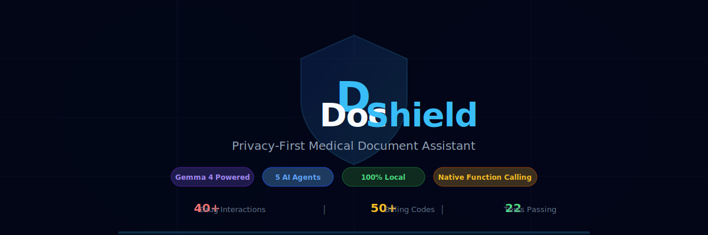
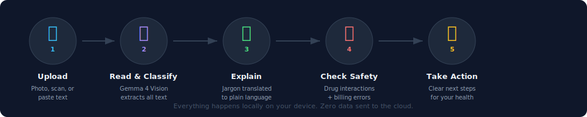

<div align="center">



[](https://ai.google.dev/gemma)
[](#-privacy--zero-data-leaves-your-device)
[](#-testing)
[](https://python.org)
[](LICENSE)

**Built for the [Kaggle Gemma 4 Good Hackathon](https://www.kaggle.com/competitions/gemma-4-good-hackathon) | $200K Prize Pool**

[Quick Start](#-quick-start) | [Use Cases](#-use-cases--real-gemma-4-output) | [Architecture](#-architecture) | [Privacy](#-privacy--zero-data-leaves-your-device)

</div>

---

## Why DocShield Exists

Every day, **billions of people** receive medical documents they can't understand. Blood tests with cryptic abbreviations. Prescriptions with dangerous drug combinations. Hospital bills with hidden overcharges.

What do they do? They upload their **most sensitive personal data** to cloud AI tools — giving away their medical history, prescriptions, and financial information to companies with no privacy guarantees.

<table>
<tr>
<td width="33%" align="center">

### 125,000+
deaths per year in the US from preventable drug interactions

</td>
<td width="33%" align="center">

### ~80%
of hospital bills contain errors or overcharges

</td>
<td width="33%" align="center">

### 36%
of US adults have basic or below health literacy

</td>
</tr>
</table>

**DocShield solves all three** — and it never sends a single byte of your data to the cloud.

---

## How It Works

<div align="center">



</div>

You upload a medical document (photo, scan, or text). DocShield's **5 AI agents** work together:

| Step | Agent | What It Does | Gemma 4 Feature |
|------|-------|-------------|-----------------|
| 1 | **Orchestrator** | Automatically detects document type | Classification |
| 2 | **Reader** | Extracts every word from photos, scans, handwriting | **Multimodal Vision** |
| 3 | **Explainer** | Translates medical jargon into plain language | Long Context + Reasoning |
| 4 | **Checker** | Queries drug interaction database for dangers | **Native Function Calling** |
| 5 | **Bill Analyzer** | Compares charges against national averages | **Native Function Calling** |

---

## Use Cases — Real Gemma 4 Output

These are **actual outputs** from DocShield running Gemma 4 locally.

---

### Use Case 1: Prescription Safety Check

<div align="center">


</div>

<details>
<summary><b>See the full Gemma 4 output (click to expand)</b></summary>

**Input:** A prescription with 4 medications — Warfarin, Lisinopril, Ibuprofen, Omeprazole.

**Step 1 — Orchestrator classifies document:**
> Document type: **Prescription**

**Step 2 — Explainer Agent translates to plain language:**

> **Warfarin (Blood Thinner):** This medication is a "blood thinner." Its job is to prevent your blood from becoming too thick or forming dangerous clots inside your body.
>
> **Lisinopril (Blood Pressure Medicine):** This medicine helps to keep your blood pressure at a healthy, consistent level. Taking it every day helps your heart and blood vessels work less hard over time.
>
> **Ibuprofen (Pain Reliever):** A word of caution: Because you are taking several other medications (especially Warfarin), taking Ibuprofen too often could potentially interfere with your other medications.
>
> **Omeprazole (Stomach Acid Reducer):** This medication is usually taken before breakfast to lower the amount of acid in your stomach.

**Step 3 — Checker Agent uses function calling to check ALL 6 drug pairs:**

```
> Checking: Warfarin + Lisinopril...     No known interaction
> Checking: Warfarin + Ibuprofen...      HIGH RISK FOUND
> Checking: Warfarin + Omeprazole...     No known interaction
> Checking: Lisinopril + Ibuprofen...    MEDIUM RISK FOUND
> Checking: Lisinopril + Omeprazole...   No known interaction
> Checking: Ibuprofen + Omeprazole...    No known interaction
```

**Checker Agent's findings:**

> **1. Warfarin and Ibuprofen (High Risk)**
> - **Risk:** Taking these two together significantly increases your risk of bleeding, especially in the stomach or digestive tract.
> - **Simple Explanation:** Ibuprofen can thin your blood and irritate your stomach lining, which, combined with Warfarin, greatly increases the chance of serious bleeding.
> - **Recommendation:** Do not take Ibuprofen without consulting your doctor. Acetaminophen is generally preferred.
>
> **2. Lisinopril and Ibuprofen (Medium Risk)**
> - **Risk:** Taking these together can reduce the effectiveness of Lisinopril and may harm your kidneys.
> - **Recommendation:** Discuss alternatives with your doctor, such as acetaminophen.
>
> **Safety Summary:** There are **two significant interactions** that need immediate attention. **It is crucial that you do not start taking Ibuprofen until you have spoken with Dr. Johnson or a pharmacist.**

</details>

> **This prescription had 2 dangerous drug interactions that most patients would never know about.** DocShield caught them in seconds.

---

### Use Case 2: Lab Report Explained

<div align="center">


</div>

<details>
<summary><b>See the full explanation (click to expand)</b></summary>

**Input:** A blood test with these confusing results:
```
Glucose (fasting)    126    70-100 mg/dL     HIGH
Creatinine           1.4    0.6-1.2 mg/dL    HIGH
LDL                  168    <100 mg/dL        HIGH
HDL                  38     >40 mg/dL         LOW
HbA1c                6.8    <5.7 %            HIGH
```

**DocShield's Explainer Agent output:**

> **Cholesterol (LDL: 168):** Your "bad cholesterol" is high at 168 when the target is under 100. This means fatty deposits could be building up in your blood vessels, increasing your risk of heart disease.
>
> **Blood Sugar (HbA1c: 6.8%):** This measures your average blood sugar over the past 3 months. At 6.8%, you are in the **pre-diabetic range** (normal is below 5.7%, diabetic is 6.5%+). This is a warning sign that needs attention.
>
> **Kidney Function (Creatinine: 1.4):** Slightly elevated above the normal range. This could indicate your kidneys are working harder than they should. It needs monitoring.
>
> **What To Do Next:**
> - Talk to your doctor about diet changes and possibly cholesterol medication
> - Recheck HbA1c in 3 months to track blood sugar trend
> - Monitor kidney function with follow-up tests

</details>

> A patient who sees "LDL: 168 mg/dL" and "HbA1c: 6.8%" has **no idea** what that means. DocShield explains it like a friend would: *"Your bad cholesterol is high and your blood sugar is in the pre-diabetic range."*

---

### Use Case 3: Hospital Bill Audit

<div align="center">


</div>

<details>
<summary><b>See the full bill analysis (click to expand)</b></summary>

**Input:** A hospital bill for $15,865 with these charges:

| Item | CPT Code | Charged |
|------|----------|---------|
| ER Visit, High Complexity | 99284 | $2,800 |
| Chest X-ray, 2 views | 71046 | $950 |
| EKG/ECG | 93000 | $450 |
| CBC Blood Test | 85025 | $250 |
| IV Saline Bag (x3) | J3490 | $2,400 |
| Room Charge (1 night) | N/A | $8,500 |
| Blood Draw | 36415 | $95 |

**DocShield's Bill Analyzer uses function calling to look up each CPT code:**

```
> Looking up: 99284... Typical: $300-$1,200
> Looking up: 71046... Typical: $50-$300      OVERCHARGE
> Looking up: 93000... Typical: $20-$100      OVERCHARGE
> Looking up: 85025... Typical: $15-$60       OVERCHARGE
> Looking up: 36415... Typical: $5-$30        OVERCHARGE
```

**Flagged overcharges:**

| Item | Charged | Typical Max | Overcharge |
|------|---------|-------------|------------|
| Chest X-ray | $950 | $300 | **+$650** |
| EKG | $450 | $100 | **+$350** |
| CBC Blood Test | $250 | $60 | **+$190** |
| IV Saline (x3) | $2,400 | ~$150 | **+$2,250** |
| Room (1 night) | $8,500 | $4,500 | **+$4,000** |
| Blood Draw | $95 | $30 | **+$65** |
| | | **TOTAL** | **~$7,500+** |

> **Action:** Request an itemized bill review from the hospital billing department. You may be able to negotiate or dispute over $7,000 in charges.

</details>

> An $8,500 room charge. A $950 chest X-ray. $2,400 for saline bags that cost $3 wholesale. **Most patients pay without questioning.** DocShield shows you what's typical and what's not.

---

## Architecture

<div align="center">


</div>

### The Multi-Agent Pipeline

```
                          +-------------------+
                          |   User uploads    |
                          |  photo or text    |
                          +--------+----------+
                                   |
                          +--------v----------+
                          |   ORCHESTRATOR    |  Classifies: prescription,
                          |      AGENT        |  lab_report, hospital_bill
                          +--------+----------+
                                   |
                          +--------v----------+
                          |   READER AGENT    |  Gemma 4 Vision: extracts
                          | (Multimodal OCR)  |  text from images
                          +--------+----------+
                                   |
                    +--------------+--------------+
                    |              |               |
           +-------v------+ +----v--------+ +----v-----------+
           |  EXPLAINER   | |  CHECKER    | |  BILL ANALYZER |
           |    AGENT     | |   AGENT     | |     AGENT      |
           |              | |             | |                |
           | Plain lang.  | | Drug inter- | | Overcharge     |
           | explanation  | | action DB   | | detection      |
           +--------------+ | (func call) | | (func call)    |
                            +-------------+ +----------------+
```

### Function Calling in Action

This is what makes DocShield a **real showcase of Gemma 4's capabilities**. The Checker Agent doesn't just guess about drug interactions — it uses Gemma 4's **native function calling** to make structured API calls:

```python
# Gemma 4 decides to call this tool:
{
    "function": {
        "name": "check_drug_interaction",
        "arguments": {
            "drug_a": "Warfarin",
            "drug_b": "Ibuprofen"
        }
    }
}

# Tool returns structured data:
{
    "found": true,
    "severity": "high",
    "effect": "Significantly increased bleeding risk",
    "recommendation": "Avoid NSAIDs with warfarin"
}

# Gemma 4 synthesizes findings into a clear, human-readable summary
```

The model decides **which tools to call**, **how many times**, and **what arguments to pass** — then synthesizes all results into a clear summary. In the prescription example above, it autonomously made **6 function calls** (checking all drug pairs) without being told which drugs to check.

---

## Quick Start

```bash
# 1. Install Ollama (https://ollama.com/download)
# Then pull Gemma 4:
ollama pull gemma4

# 2. Clone and install
git clone https://github.com/kennedyraju55/docshield.git
cd docshield
pip install flask pillow requests

# 3. Run
python app.py
```

Open **http://localhost:5000** — that's it.

### Try It Instantly

The web UI includes **sample buttons**. Click "Prescription", "Lab Report", or "Hospital Bill" to load a real sample document and watch DocShield analyze it — no uploading needed.

---

## Privacy — Zero Data Leaves Your Device

This is not just a feature. It's the **core principle**.

| | Cloud AI Tools | DocShield |
|---|---|---|
| Where does processing happen? | Their servers | **Your device** |
| Who sees your medical data? | The company + any partners | **Only you** |
| Does it work offline? | No | **Yes** |
| Is your data stored? | Usually yes | **Never** |
| Can it be subpoenaed? | Yes, from their servers | **No server to subpoena** |
| HIPAA concerns? | Possible violation | **No data transmission** |

### How?

DocShield runs **Gemma 4 locally via Ollama**. The Flask server runs on `127.0.0.1` (localhost only). No outbound network calls are made. Your medical documents are processed in RAM and never written to disk.

For edge deployment, Gemma 4 E4B can run on **smartphones** — enabling a future where the world's most vulnerable patients have a medical document assistant in their pocket, with full privacy, even without internet.

---

## Databases

### Drug Interaction Database (40+ interactions)

Covers the most dangerous and common interactions including:

| Category | Examples |
|----------|---------|
| **Blood thinners + NSAIDs** | Warfarin + Ibuprofen, Warfarin + Aspirin |
| **Serotonin syndrome** | SSRIs + Tramadol, Fluoxetine + Sertraline |
| **FDA Black Box** | Benzodiazepines + Opioids (Xanax + Oxycodone) |
| **Blood pressure** | ACE inhibitors + Potassium, ACE + NSAIDs |
| **Statin risks** | Simvastatin + Amlodipine, Statins + Grapefruit |
| **Thyroid** | Levothyroxine + Calcium/Iron/PPIs |
| **Antibiotics** | Ciprofloxacin + Tizanidine, Azithromycin + Amiodarone |

Includes **50+ brand name aliases** (Coumadin -> Warfarin, Advil -> Ibuprofen, Xanax -> Alprazolam, etc.)

### Billing Reference Database (50+ CPT codes)

Covers common procedures with typical US price ranges:

| Category | Codes |
|----------|-------|
| Office visits | 99201-99215 (new + established patient) |
| ER visits | 99281-99285 (all complexity levels) |
| Lab tests | CBC, CMP, BMP, HbA1c, Lipid Panel, TSH, Urinalysis |
| Imaging | Chest X-ray, MRI (brain, spine), CT, Ultrasound, Mammogram |
| Cardiac | EKG, Echocardiogram, Stress Test |
| Procedures | Endoscopy, Colonoscopy, Biopsy |
| Other | Vaccines, Injections, Physical Therapy, Critical Care |

---

## Testing

```bash
pip install pytest
pytest tests/ -v
```

```
tests/test_tools.py    - 13 tests (drug interactions + billing lookups)
tests/test_agents.py   -  5 tests (reader, explainer with mock backend)
tests/test_app.py      -  4 tests (Flask endpoints)
─────────────────────────────────────────
Total                    22 tests, ALL PASSING
```

---

## Project Structure

```
docshield/
  agents/
    orchestrator.py          Classifies document type, routes to agents
    reader_agent.py          Gemma 4 Vision: image -> text
    explainer_agent.py       Medical jargon -> plain language
    checker_agent.py         Drug interaction check (function calling)
    bill_analyzer_agent.py   Bill overcharge detection (function calling)
  tools/
    drug_interactions.py     40+ drug-drug interactions + brand aliases
    billing_reference.py     50+ CPT codes with US price ranges
    tool_registry.py         Function calling registry
  ollama_backend.py          Local Ollama integration (chat, vision, tools)
  kaggle_backend.py          Kaggle/Google GenAI integration
  image_utils.py             Image preprocessing for vision
data/
  drug_interactions.json     Drug interaction database
  billing_codes.json         CPT code + pricing database
  medical_abbreviations.json 70+ medical abbreviation definitions
templates/
  index.html                 Web UI (dark theme, upload, streaming)
tests/                       22 unit + integration tests
docs/                        SVG diagrams and visuals
notebook.ipynb               Kaggle submission notebook
```

---

## Gemma 4 Features Showcased

<table>
<tr>
<td width="50%">

### Multimodal Vision
The Reader Agent sends document photos directly to Gemma 4's vision model. It handles printed text, handwritten prescriptions, scanned PDFs, and screenshots — extracting every word, date, code, and number.

</td>
<td width="50%">

### Native Function Calling
The Checker and Bill Analyzer agents use Gemma 4's built-in function calling. The model autonomously decides which tools to call, how many times, and with what arguments — then synthesizes results into human-readable summaries.

</td>
</tr>
<tr>
<td>

### Multi-Agent Architecture
5 specialized agents with distinct roles, orchestrated in a pipeline. Each agent has its own system prompt, tools, and output format. The Orchestrator routes documents to the right specialist chain automatically.

</td>
<td>

### On-Device / Edge Ready
Designed to run on Gemma 4 E4B for smartphone deployment. The architecture separates the LLM backend (Ollama vs Kaggle vs on-device) from the agent logic, making it easy to swap between deployment targets.

</td>
</tr>
</table>

---

## Hackathon

| | |
|-|-|
| **Competition** | [Gemma 4 Good Hackathon](https://www.kaggle.com/competitions/gemma-4-good-hackathon) |
| **Track** | Health |
| **Prize Pool** | $200,000 |
| **Deadline** | May 18, 2026 |

### Why This Should Win

1. **Real impact** — Drug interactions kill 125K+ people/year. Billing errors cost patients billions. DocShield addresses both.
2. **Full Gemma 4 showcase** — Vision, function calling, multi-agent, on-device. Every key feature is used meaningfully.
3. **Working product** — Not a concept. A complete, tested, deployable application with a polished UI.
4. **Privacy-first** — The strongest "for good" angle: protecting the most vulnerable patients' most sensitive data.
5. **Universal** — Works in any language, any literacy level, any country. No internet required.

---

## License

MIT

---

<div align="center">

**DocShield** — *Because understanding your health shouldn't require a medical degree.*

Built with [Gemma 4](https://ai.google.dev/gemma) for the [Gemma 4 Good Hackathon](https://www.kaggle.com/competitions/gemma-4-good-hackathon)

</div>
